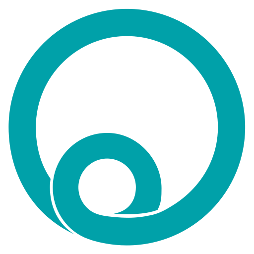

<div align="center">

<a href="https://omniconsole.dev">
  
</a>

# Omni Console

**The serial monitor that decodes industrial protocols.**

Watch, decode and *drive* serial traffic in real time — Modbus, DLMS, M-Bus, IEC 62056-21 and MASS — with line sniffing, an online device library, Python flow automation and AI control. One fast desktop app for **Windows & Linux**.

[](https://github.com/OmniCoreST/omniconsole/releases/latest)

[](https://omniconsole.dev)

[**⬇ Download**](https://omniconsole.dev/download/) · [**Website**](https://omniconsole.dev) · [**Features**](https://omniconsole.dev/features/) · [**Pricing**](https://omniconsole.dev/pricing/) · [**Device library**](https://omniconsole.dev/device-library/) · [**AI / MCP**](https://omniconsole.dev/ai-mcp/)

</div>

---

**Omni Console** is a fast, cross-platform serial-port monitor and protocol decoder for engineers working with meters, drives, PLCs and field instruments. Capture or **sniff** a live line, decode a dozen industrial protocols into readable values, **build and send** valid frames, **automate** with Python-powered flows, and even hand the controls to an **AI agent** — all in one app, on Windows and Linux. Learn more at **[omniconsole.dev](https://omniconsole.dev)**.

---

## ⬇ Download

| OS | Package | Requirements | Download |
|----|---------|--------------|----------|
| **Windows** | Installer (`.exe`) | Windows 10 / 11 · 64-bit | [OmniConsole-Setup-1.0.7.exe](https://github.com/OmniCoreST/omniconsole/releases/download/v1.0.7/OmniConsole-Setup-1.0.7.exe) |
| **Linux** | AppImage | x86-64 · glibc 2.31+ | [OmniConsole-1.0.7-x86_64.AppImage](https://github.com/OmniCoreST/omniconsole/releases/download/v1.0.7/OmniConsole-1.0.7-x86_64.AppImage) |

Get the newest build any time from the **[Releases page](https://github.com/OmniCoreST/omniconsole/releases/latest)** — or just open the app, which keeps itself up to date. Full instructions at **[omniconsole.dev/download](https://omniconsole.dev/download/)**.

> **Linux:** `chmod +x OmniConsole-*.AppImage`, then run it — no install required.

---

## ✨ Why Omni Console

Three things set it apart from a plain terminal or a single-protocol poller:

- **⚡ Real-time and byte-accurate.** Coalesced RX with precise timestamps, pause/resume, RX/TX filtering and instant full-text search across the whole trace — backed by a fast SQLite store.
- **🔍 It decodes, it doesn't dump.** Protocol-aware decoding turns raw bytes into readable frames — Modbus register maps, DLMS OBIS, M-Bus DIF/VIF, request ↔ response pairing and exception decoding.
- **🤖 Automate & integrate.** Drive the bus with visual **flows** and Python, let an **AI agent** operate the app over MCP, or reach a remote edge device's serial port over **SSH**.

---

## 🧩 Protocol coverage

**Twelve protocols decode automatically** — point Omni Console at any line and read labelled frames instead of raw hex. Five go all the way to named, unit-aware engineering values, with command builders for three of them.

**Full value parsing + frame builders**

| Protocol | Decode | Command builder | Value parsing |
|----------|:------:|:---------------:|:-------------:|
| **Modbus** (RTU · ASCII · TCP) | ✅ | ✅ | ✅ |
| **DLMS / COSEM** (HDLC, OBIS, AES-GCM, HLS) | ✅ | ✅ | ✅ |
| **M-Bus** (self-describing DIF/VIF) | ✅ | ✅ | ✅ |
| **IEC 62056-21** (Mode A–E sign-on) | ✅ | Quick-send | ✅ |
| **MASS** (Turkish metering standard) | ✅ | Quick-send | ✅ |

**Frame & field decoding** — framing, addresses, function codes and CRC checked and labelled

| Protocol | Decode | Command builder | Value parsing |
|----------|:------:|:---------------:|:-------------:|
| **DNP3** (IEEE 1815) | ✅ | Quick-send | — |
| **BACnet MS/TP** | ✅ | Quick-send | — |
| **HART** | ✅ | Quick-send | — |
| **IEC 60870-5-101** | ✅ | Quick-send | — |
| **IEC 60870-5-103** | ✅ | Quick-send | — |
| **PROFIBUS** (DP / PA) | ✅ | Quick-send | — |
| **O1TP** (proprietary framing) | ✅ | Quick-send | fields |
| Any other serial line | raw + 10 display modes | Quick-send | — |

➡️ **[Explore the protocols →](https://omniconsole.dev/features/)**

---

## 🔧 What's inside

<table>
<tr><td valign="top" width="50%">

**Connect & capture**
- Open any serial port with full control (baud, data, parity, stop)
- Auto baud-rate negotiation when you don't know the line
- **Sniff mode** — tap a live conversation between another app and a device (Windows **and** Linux)
- **Remote edge** — open a remote Linux device's serial port over SSH
- Exclusive port with cooperative GUI ↔ AI sharing of one trace

**See & decode**
- Ten display modes: ASCII, HEX, Mixed, Decimal, Binary, Raw, Events…
- Request ↔ response pairing and exception decoding
- Precise timestamps, pause/resume, RX/TX filtering, full-text search

</td><td valign="top" width="50%">

**Build & send**
- Modbus frame builder — FC 01–06, 0F, 10 with CRC/LRC
- M-Bus telegram builder with FCB handling
- DLMS GET / SET / ACTION builder, optionally AES-GCM ciphered
- Quick send (ASCII/HEX/Mixed) + a saved sequence library

**Automate & integrate**
- **Flows** — visual blocks or a Python-flavoured DSL, sandboxed
- Triggers: RX match, timeout, connect or periodic schedule
- **AI control** over an embedded local MCP server
- Export trace as CSV / BIN / TXT / HTML · save `.o1p` projects

</td></tr>
</table>

Cross-platform (Windows & Linux) · light / dark / system themes · English & Turkish · built-in auto-updater.

➡️ **[See the full feature list →](https://omniconsole.dev/features/)**

---

## 📚 Online device library

Omni Console ships with an **online Modbus device library**. Browse it in-app, load a register map (fetched on demand and **SHA-256 verified**), and every register comes back **named, typed, scaled and unit-aware** — no more transcribing register tables out of a PDF.

The catalogue is open and lives in [`modbus-library/`](./modbus-library): **144 maps across 27 vendors**, including **Moxa, Advantech, Carlo Gavazzi, Entes, Eastron, Circutor, ABB, Lovato, Accuenergy, Janitza, Schneider, Socomec, Chint, Finder, Klemsan** and more.

<details>
<summary><b>Map format & contributing a device</b></summary>

<br>

Each device is one plain-TOML file named `<vendor>-<model>.toml`:

```toml
vendor = "ABB"
model = "A43/A44"
description = "3-phase energy & power quality meter — per-phase V/I/P/Q/S/PF, frequency, 64-bit energy import/export (FC03, Big-Endian)."

[[registers]]
address = 23296        # raw Modbus register address (as on the wire)
type    = "u32"        # u16 · s16 · u32 · s32 · u64 · s64 · f32 …
name    = "Voltage L1-N"
unit    = "V"
scale   = 0.1          # engineering value = raw × scale

[[registers]]
address = 23340
type    = "u16"
name    = "Frequency"
unit    = "Hz"
scale   = 0.01
```

> Add `word_order = "little"` on a register when a multi-word value isn't big-endian (MSW-first).

**Add your device** — the catalogue grows by pull request, and one map helps everyone decoding that meter:

1. **Fork** this repository.
2. Add `modbus-library/<vendor>-<model>.toml` (lowercase, hyphenated).
3. Fill in `vendor`, `model`, `description` and the `[[registers]]` table, citing your source datasheet in a top comment.
4. **Open a pull request.** Once merged, the map appears in-app for everyone.

</details>

➡️ **[About the device library →](https://omniconsole.dev/device-library/)**

---

## 🤖 AI control (MCP)

Omni Console embeds a **local [Model Context Protocol](https://modelcontextprotocol.io) server**, so an AI agent can operate the instrument *alongside you* — opening ports, sending frames, reading & decoding the trace, and building sequences, flows and device maps. The agent and the GUI share **one port and one trace**, so you both see every byte live.

Point any MCP client at the local endpoint:

```json
{
  "mcpServers": {
    "omni-console": { "url": "http://127.0.0.1:9009/mcp" }
  }
}
```

- Bound to **`127.0.0.1` only** — no cloud, a single-user local control plane.
- MCP Streamable-HTTP transport · enabled by default (toggle in settings).

➡️ **[How AI control works →](https://omniconsole.dev/ai-mcp/)**

---

## 🚀 From install to decoded traffic in minutes

1. **Download & open** — install on Windows or Linux and launch. No account needed.
2. **Connect a port** — pick a port and baud (or auto-negotiate). Sniff a live line, or reach one over SSH.
3. **Watch it decode** — traffic streams in, decoded per protocol. Automate it with flows, or let an AI agent take the wheel.

Installed copies check for **signed updates** and refresh themselves in place — you're always on the latest build.

---

## 💳 Pricing & licensing

Every feature is unlocked for a **free 30-day trial** — no account, no credit card. After that, a one-time license keeps it running. **Pay once, own it — no subscription.**

| License | Devices | Price (one-time) |
|---------|:-------:|:----------------:|
| Single Device | 1 | **$39.90** |
| 3 Devices | 3 | **$99.90** |
| 5 Devices | 5 | **$149.90** |

Secure checkout, tax & invoicing handled by **Paddle**. 14-day refund policy.

➡️ **[See pricing & buy →](https://omniconsole.dev/pricing/)**

---

## 🔗 Links

| | |
|---|---|
| 🌐 Website | **[omniconsole.dev](https://omniconsole.dev)** |
| ⬇ Download | [omniconsole.dev/download](https://omniconsole.dev/download/) |
| 🧩 Features | [omniconsole.dev/features](https://omniconsole.dev/features/) |
| 📚 Device library | [omniconsole.dev/device-library](https://omniconsole.dev/device-library/) |
| 🤖 AI / MCP | [omniconsole.dev/ai-mcp](https://omniconsole.dev/ai-mcp/) |
| 💳 Pricing | [omniconsole.dev/pricing](https://omniconsole.dev/pricing/) |
| ✉️ Contact | [omni@omnicore.com.tr](mailto:omni@omnicore.com.tr) |

---

<div align="center">

Made by **Omnicore Stratejik Teknolojiler Ltd. Şti.** · Türkiye 🇹🇷

<sub>Omni Console · serial monitor & industrial-protocol decoder for Windows & Linux · [omniconsole.dev](https://omniconsole.dev)</sub>

</div>
